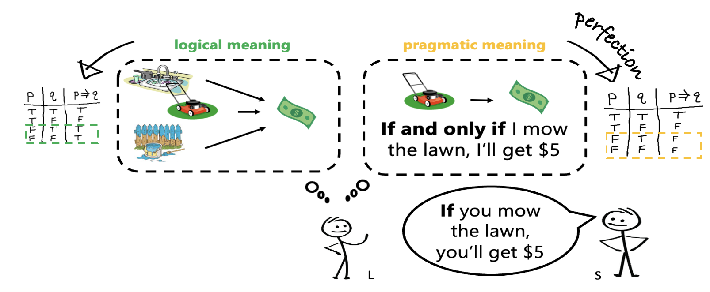
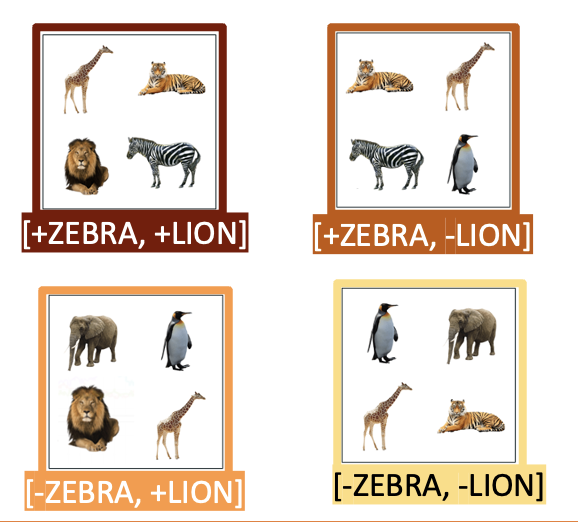

--- 
layout: archive 
title: "Research" 
permalink: /research/ 
author_profile: true 
---
**This page is long overdue for an update!**

<h2 style="margin: 20px 0px 10px;">Conditional Perfection: Pragmatic Inference in Human Reasoning</h2>

> 

  Why is the response "Wait, what if I don't?" taken humorously when someone says "if you want, there are cookies in the cupboard," yet it's completely reasonable to ask the same question in response to "if you mow the lawn, you'll receive 5 dollars"?
  <a href="javascript:void(0);" id="readMoreLink1" onclick="toggleText('moreText1')">Read More</a>
  

    We frequently understand utterances more deeply than their explicit content suggests. For example, "Mary had cheesecake for dessert" often implies she had only cheesecake, and "I ate some of your cookies" suggests I didn't eat all of them. We make these inferences swiftly during real-time language processing. In this project, with <a href="https://psychology.ucsd.edu/people/profiles/dbarner.html" target="_blank">David Barner</a>, we investigate how this feat is accomplished: Do listeners initially adopt a non-logical, pragmatic interpretation or begin with a logical meaning and then enrich the conditional statement via inference?
  

<h2 style="margin: 40px 0px 10px;"> Role of Negation and Alternatives in Counterfactuals</h2>

> 

  
  Counterfactuals enable us to imagine scenarios different from reality, often conveying meanings understood by contrasting potential realities. For example, the statement 'If there had been zebras, there would have been lions in the zoo' implies a hypothetical world with these animals, yet indicates their absence in reality. This involves mentally contrasting the actual world with the hypothetical one suggested by the counterfactual.
  <a href="javascript:void(0);" id="readMoreLink2" onclick="toggleText('moreText2')">Read More</a>
  

    Using web-based eye tracking, with <a href="https://people.ceu.edu/eva_wittenberg" target="_blank">Eva Wittenberg</a>, we focus on how negation and the availability of alternatives shape our mental representations during this process. A negated counterfactual, like 'If there had been no zebras, there would have been no lions in the zoo', suggests a world without these animals, while implicitly confirming their existence. These negated counterfactuals help answer the implicit Question under Discussion (QuD) by reducing uncertainty and creating specific mental images. This interaction indicates that the cognitive effort in comprehending counterfactuals primarily arises from uncertainty over alternative states and QuD accommodation.
  

<h2 style="margin: 40px 0px 10px;"> Pronoun Resolution in Turkish </h2>

> 

   In natural communication settings, ambiguous referring expressions like 'she', 'that', 'there', 'then' are rarely encountered without context. They usually appear after a meaningful discourse, enabling the construction of plausible hypotheses about their reference. Even within coherent discourse, identifying the correct reference among multiple alternatives is complex, involving understanding who or what the utterance is about, the event, the participants and their roles, and the relationship of the utterance to other discourse elements. Focusing on Turkish, with <a href="https://users.metu.edu.tr/duyguo/" target="_blank">Duygu Özge</a>, we examine how null and overt pronouns are interpreted across different verb types, coherence relations, valency, and word order. 

