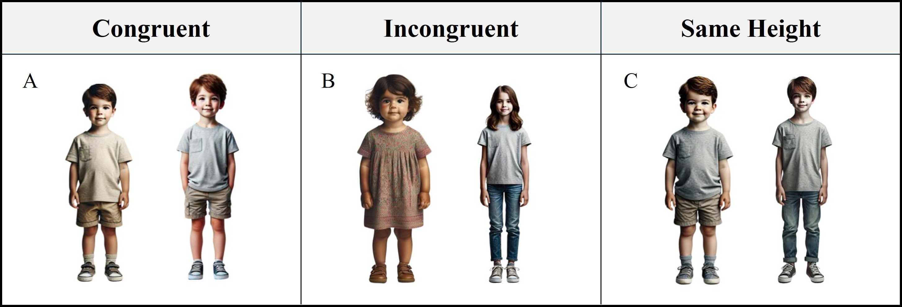
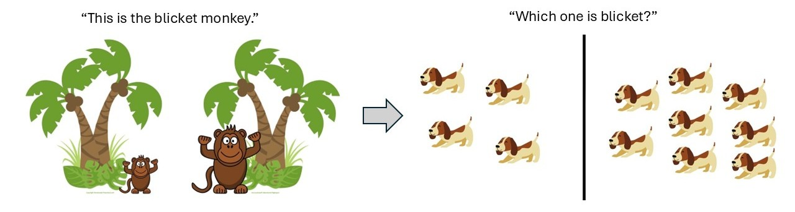
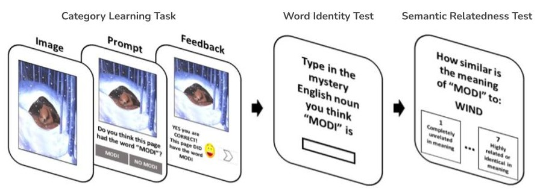

--- 
layout: archive 
title: "Research" 
permalink: /research/ 
author_profile: true 
---
<h2 style="margin: 20px 0px 10px;">Development of the Concept of Age</h2>

> 

  
  Age is a very salient and important concept in our social world, yet little is known about how children come to understand it. In a first project, with <a href="https://psychology.ucsd.edu/people/profiles/dbarner.html" target="_blank">David Barner</a>, we found that preschool-aged children are able to use cues such as numerical age and facial and bodily morphology to judge which of two people is older, even if the older person was made to look smaller. Furthermore, we found that children's age judgments were related to their numerical knowledge. This suggests that children may not initially conflate age with size as suggested by prior studies, and that children only base age judgments on size when other cues are unavailable or not sufficiently discriminable.
  <a href="javascript:void(0);" id="readMoreLink1" onclick="toggleText('moreText1')">Read More</a>
  

    In a current project, we are asking whether children's understanding of age group labels such as "grown up" and "child" at 3 years old reflects young children's understanding of the chronological progression of aging, or if children have only formed categories of people and mapped them onto these labels without understanding age chronologically yet. If the latter is true, it would suggest that these early-formed categories of age groups may serve as placeholder structures in the construction of the concept of age, with the development of the ability to think about time chronologically and quantitatively, potentially aided by the acquisition of a number system, later enabling these categories to be transferred onto a chronological representation of age. Finally, another project investigates whether 4- to 6-year-old children are able to use age to guide a range of predictions about people, such as their cognitive and physical development, their authority or dependency, and their preferences.
  

<h2 style="margin: 40px 0px 10px;">Development of Temporal Quantification</h2>

> 

  Words which denote temporal durations are highly prevalent in natural language but appear to pose a learning challenge for young children. With <a href="https://psychology.ucsd.edu/people/profiles/dbarner.html" target="_blank">David Barner</a>, we investigate the challenges children may face in learning time words through a case study of the comparative "more". We ask whether 3- to 4-year-old children are able to comprehend "more" as applied to temporal duration (e.g., "John danced more than Mary"). On the one hand, that children only learn the precise meanings of words which denote temporal durations (e.g., "second", "hour") at 6 or 7 years old might suggest that young children may face a similar delay in learning "more" in reference to duration. On the other hand, prior research which has demonstrated comprehension of "more" in reference to numerical and spatial quantities at 3 years old and theories which posit a domain-general magnitude system common to number, space, and time may suggest that children would be able to apply their understanding of "more" to time already at 3 years old. Through this investigation, we aim to shed light on the mechanisms of time word learning and the relation of temporal quantification to quantification in other domains.
  <a href="javascript:void(0);" id="readMoreLink2" onclick="toggleText('moreText2')">

<h2 style="margin: 40px 0px 10px;">Emotion Labeling from Desire Outcomes for Self and Other</h2>

> 
 
   Children's ability to label emotions greatly improves between 2 and 3 years old. However, an interesting feature of children's task in labeling emotions remains unstudied: The same emotion categories and words apply to the self and others, but while a child has access to their own emotions, they can only infer them from others based on situations and expressions. With <a href="https://psychology.ucsd.edu/people/profiles/dbarner.html" target="_blank">David Barner</a>, we ask whether children are better at identifying that one is "happy" when their desire has been fulfilled and "sad" when it has not for themselves or for others, in an attempt to shed light on how this crucial difference in information access may affect early emotion identification.

<h2 style="margin: 40px 0px 10px;">Analogical Extension of Novel Words Across Dimensions</h2>

> 
 
    
   Magnitude words pose an interesting learning challenge for children as adjectives like "long" and "short" and "big" and "small" encode multiple dimensions of experience, such as number, time, and space. With <a href="https://urvi-maheshwari.github.io/" target="_blank">Urvi Maheshwari</a> and <a href="https://psychology.ucsd.edu/people/profiles/dbarner.html" target="_blank">David Barner</a>, we ask whether children begin with narrow meanings for magnitude words, restricted to the labeled dimension and only later extended to other dimensions via analogy, or broad meanings which span multiple dimensions. To do so, we ask whether 2- to 5-year-old children who learn a novel adjective denoting a magnitude in a spatial or numerical dimension readily extend it to an untrained dimension. This work aims to uncover the nature of children's hypotheses for word meanings and the role of analogy in word learning.

<h2 style="margin: 40px 0px 10px;">Learning Abstract Nouns from Visual Scenes</h2>

> 
 
    
   Although the child's first few words label whole, concrete objects (e.g., "ball"), such highly concrete words make up only a small fraction of the adult lexicon. How, then are more abstract words learned? With <a href="https://psychology.uconn.edu/person/umay-suanda/" target="_blank">Umay Suanda</a>, we investigate the informativity of visual scenes for learning hard nouns, a class of abstract words. We reinvestigate the claim that the meanings of hard nouns cannot be learned from the visual scenes they co-occur with. Rather, through an adult cross-situational word learning task which includes several novel tests of learning, we find that although it is indeed difficult to learn the full meaning of a hard noun from its observational contexts, these visual scenes may inform a significant amount of systematic partial knowledge of the word's meaning. It is possible that this foundation of knowledge about the word's meaning plays a role in leading the learner to full understanding when other sources of information, such as linguistic contexts, are incorporated.

